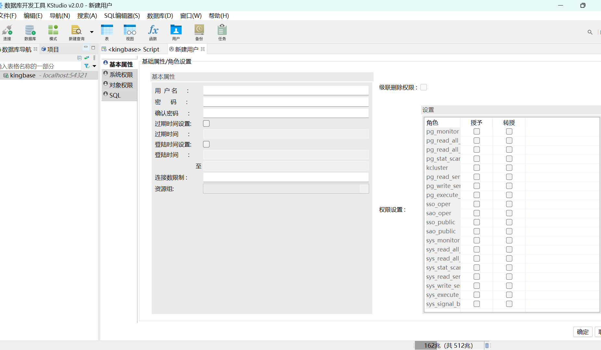
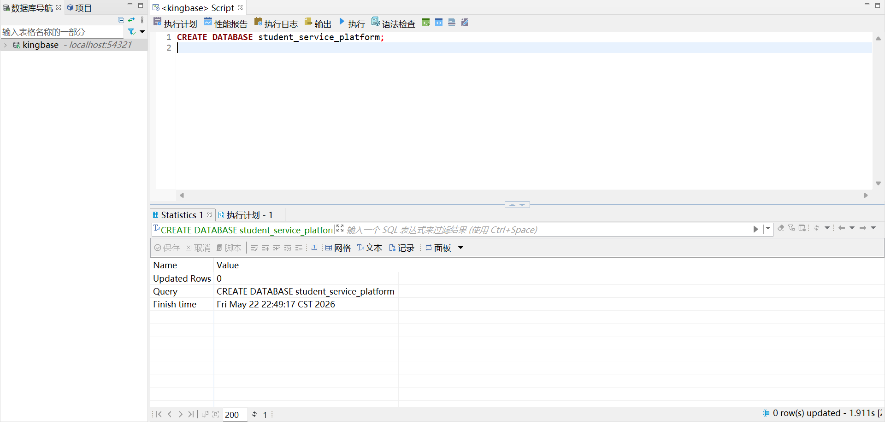
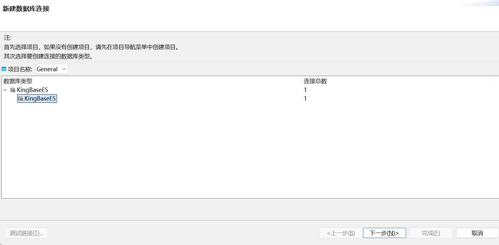
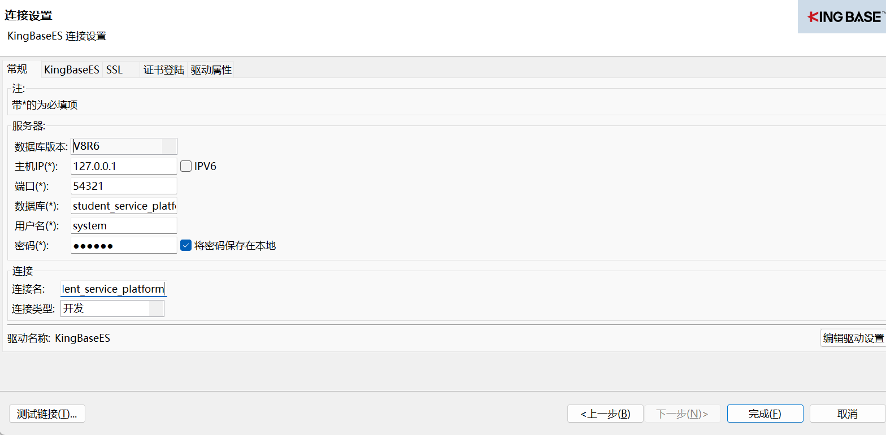
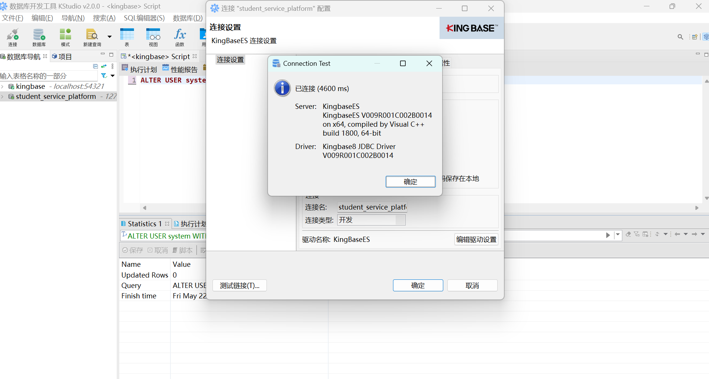

# 本地人大金仓数据库统一规范

## 1. 当前代码实际读取的数据库配置

后端入口在 [server/index.js](../server/index.js)。

当前代码会读取这些环境变量：

- `PORT`
- `TOKEN_SECRET`
- `DB_HOST`
- `DB_PORT`
- `DB_USER`
- `DB_PASSWORD`
- `DB_NAME`

当前代码中的默认值如下：

```js
const PORT = Number(process.env.PORT || 3001);
const TOKEN_SECRET = String(process.env.TOKEN_SECRET || "dev-secret-change-me");
const DB_HOST = String(process.env.DB_HOST || "127.0.0.1");
const DB_PORT = Number(process.env.DB_PORT || 54321);
const DB_USER = String(process.env.DB_USER || "myuser");
const DB_PASSWORD = String(process.env.DB_PASSWORD || "");
const DB_NAME = String(process.env.DB_NAME || "mydb");
```

当前 `server/.env` 中已经设置为：

```env
PORT=3001
TOKEN_SECRET=dev-secret-change-me
DB_HOST=127.0.0.1
DB_PORT=54321
DB_USER=system
DB_PASSWORD=123456
DB_NAME=student_service_platform
```

当前 `server/index.js` 已经包含：

```js
require('dotenv').config();
```

因此，直接运行 `npm start` 时会优先读取 `server/.env`。

## 2. 团队统一规范

建议 4 个人统一成下面这一套，减少沟通和联调成本。

### 2.1 统一内容

- `DB_HOST=127.0.0.1`
- `DB_PORT=54321`
- `DB_NAME=student_service_platform`
- `DB_USER=system`
- `DB_PASSWORD=123456`
- `PORT=3001`
- `TOKEN_SECRET=dev-secret-change-me`

建议每个人本地都创建同名数据库和同名数据库用户，这样所有人的 `server/.env` 都可以保持一致。

### 2.2 统一后的 `server/.env`

```env
PORT=3001
TOKEN_SECRET=dev-secret-change-me
DB_HOST=127.0.0.1
DB_PORT=54321
DB_USER=system
DB_PASSWORD=123456
DB_NAME=student_service_platform
```

### 2.3 必须保持一致的数据库对象

后端启动时会自动执行 [server/schema.sql](../server/schema.sql) 建表。以下表名必须一致：

- `permitted_accounts`
- `users`
- `knowledge_qa`
- `party_students`
- `student_notifications`
- `student_notification_targets`
- `document_templates`
- `honor_items`
- `class_activities`
- `class_activity_rejections`
- `class_activity_reviews`
- `class_activity_participants`
- `training_plans`
- `semester_courses`
- `student_transcripts`

### 2.4 只统一表结构还不够

如果没有初始化数据，项目可能能启动但无法正常使用。尤其是：

- `permitted_accounts` 决定哪些账号允许登录
- `knowledge_qa` 决定政策问答是否有内容
- `training_plans`、`semester_courses` 决定学业预警模块是否有数据

所以团队需要再统一一份初始数据导入方案。

## 3. 在本地人大金仓新建数据库和用户

下面按“新机器第一次配置”的顺序操作。

### 3.1 启动人大金仓

先确认你本机已经安装并启动了人大金仓。

你需要确认这几项：

- 服务已经启动
- 监听端口是 `54321`
- 你有一个管理员账号可以登录数据库管理工具

如果端口不是 `54321`，有两种做法：

- 修改金仓端口为 `54321`
- 或者保留原端口，但把 `server/.env` 里的 `DB_PORT` 改成你的实际端口

为了团队统一，建议使用 `54321`。

### 3.2 登录数据库管理工具

打开人大金仓自带的管理工具，使用管理员账号登录实例。

常见信息通常类似：

- 主机：`127.0.0.1`
- 端口：`54321`
- 管理员用户名：安装时设置的管理员账号
- 管理员密码：安装时设置的密码

### 3.3 新建数据库用户

在管理工具中找到“登录/用户/角色管理”之类的入口，新建用户：

- 用户名：`system`
- 密码：`123456`



如果工具要求确认权限，至少保证这个用户具备：

- 连接数据库权限
- 建表权限
- 增删改查权限

如果已有该用户，就进行下一步

### 3.4 新建数据库

在管理工具中找到“数据库管理”，新建数据库：

- 数据库名：`student_service_platform`
- 字符集：优先选 `UTF8`
- 所有者：`system`

如果新建数据库时不能直接指定所有者，也可以先创建数据库，再把权限授予 `system`。

或者
打开 SQL 编辑器，执行：
CREATE DATABASE student_service_platform;


测试连接：
新建连接，双击



填写：

连接名：student_service_platform
主机：127.0.0.1
端口：54321
数据库：student_service_platform
用户名：system
密码：123456



点击测试连接检测成功，如果保存就截图问ai




### 3.6 配置项目的 `server/.env`

把 (../server/.env) 设置为：

```env
PORT=3001
TOKEN_SECRET=dev-secret-change-me
DB_HOST=127.0.0.1
DB_PORT=54321
DB_USER=system
DB_PASSWORD=123456
DB_NAME=student_service_platform
```
（这一步不用做，所有人都是一样的，git同步过了，可以检查一下）

### 3.7 启动后端

在项目根目录执行：

```powershell
Set-ExecutionPolicy -Scope CurrentUser -ExecutionPolicy RemoteSigned
cd server
npm install
npm start
```

后端启动后会自动尝试连接数据库，并执行 `schema.sql` 建表。

### 3.8 导入初始数据

如果只建表不导数据，登录和部分业务仍然不可用。

因此还需要从已经能运行项目的同学电脑中导出：

- 表数据
- 上传文件
- 模板文件

至少要保证 `permitted_accounts` 有数据。

## 4. 建议的团队执行方式

建议统一按下面顺序执行：

1. 每个人本机安装并启动人大金仓
2. 每个人本机创建 `system / 123456`
3. 每个人本机创建 `student_service_platform`
4. 每个人统一使用同一份 `server/.env`
5. 启动后端，让它自动建表
6. 从已经跑通的同学那里导出并导入初始化数据

这样做的好处是：

- 文档简单
- 不需要每个人记自己的数据库名
- 不需要每个人改本地配置
- 联调时环境差异最小
