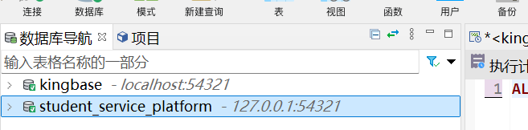
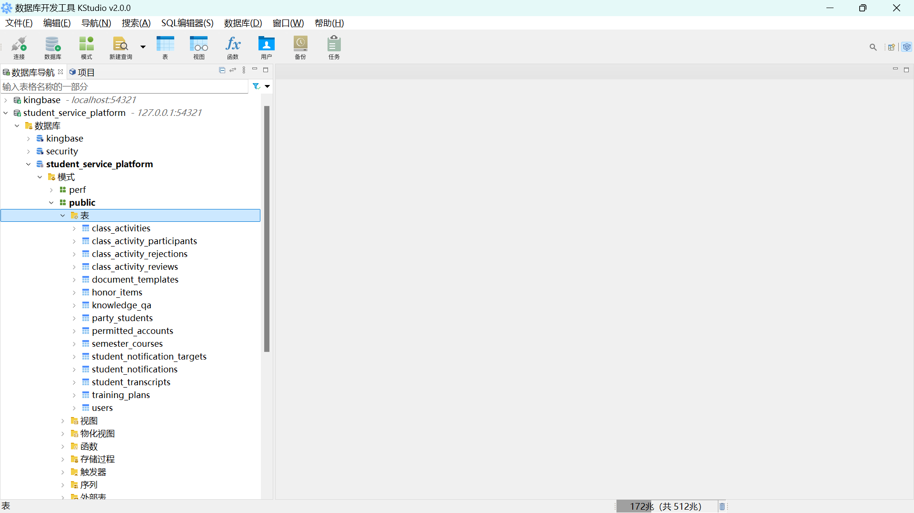

### 1. 统一数据库建库步骤

1. 启动人大金仓

先确认你本机已经安装并启动了人大金仓。

打开人大金仓自带的管理工具，使用管理员账号登录实例。

在管理工具中找到“登录/用户/角色管理”之类的入口，新建用户：

- 用户名：`system`
- 密码：`123456`
（这一步之前上机课应该已经做过，如果有system用户了就改一下密码就行）


如果工具要求确认权限，至少保证这个用户具备：

- 连接数据库权限
- 建表权限
- 增删改查权限

如果已有该用户，就进行下一步

2. 新建数据库

打开 SQL 编辑器，执行：
CREATE DATABASE student_service_platform;


测试连接：
新建连接，双击


填写：

连接名：student_service_platform
主机：127.0.0.1
端口：54321
数据库：student_service_platform
用户名：system
密码：123456


点击测试连接检测成功，如果保存就截图问ai


3. 回到项目，配置项目的 `server/.env`

把 (../server/.env) 设置为：

```env
PORT=3001
TOKEN_SECRET=dev-secret-change-me
DB_HOST=127.0.0.1
DB_PORT=54321
DB_USER=system
DB_PASSWORD=123456
DB_NAME=student_service_platform
```
（这一步不用做，所有人都是一样的，git同步过了，可以检查一下）

4. 启动后端
先在数据库管理工具
右键点击数据库

后点击“连接”

在项目根目录执行：

```powershell
Set-ExecutionPolicy -Scope CurrentUser -ExecutionPolicy RemoteSigned
cd server
npm install
npm start

```

后端启动后会自动尝试连接数据库，并执行 `schema.sql` 建表。

5. 回到数据库管理工具，点开左栏：



检查自动建表：
如果后端 npm start 已经成功连接数据库并执行了 schema.sql，这里应该能看到这些表
permitted_accounts
users
knowledge_qa
party_students
student_notifications
student_notification_targets
document_templates
honor_items
class_activities
class_activity_rejections
class_activity_reviews
class_activity_participants
training_plans
semester_courses
student_transcripts


6. 导入初始数据

你现在数据库状态是：

数据库创建成功
后端连接成功
schema.sql 自动建表成功
初始化数据缺失

如果只建表不导数据，登录和部分业务仍然不可用。

因此还需要从已经能运行项目的同学电脑中导出：

- 表数据
- 上传文件
- 模板文件

至少要保证 `permitted_accounts` 有数据。

所以在 student_service_platform 下打开sql编辑器执行：

```

-- 初始化数据导入脚本
-- 使用前确认当前连接数据库是 student_service_platform
-- schema 是 public

BEGIN;

-- 1. permitted_accounts
INSERT INTO public.permitted_accounts
(id, role, account_id, enabled, created_at)
VALUES
(1, 'admin', '10001', true, 1710000000000),
(2, 'student', '20230001', true, 1710000000000),
(3, 'student', '20230002', true, 0)
ON CONFLICT (id) DO NOTHING;


-- 2. knowledge_qa
INSERT INTO public.knowledge_qa
(id, question, answer, keywords, enabled, created_at, updated_at)
VALUES
(
  1,
  '请问信息学院本科生学习优秀类奖学金相关政策是什么？',
  '本科生学习优秀和学习进步奖学金由学校统筹各方面资金设立，主要奖励在学习方面表现突出和进步明显的学生。本科生学习优秀奖学金分为特等、一等、二等、三等四个等级，奖励标准分别为 8000 元/人、5000 元/人、3000 元/人、2000元/人；本科生学习进步奖学金分为一等、二等两个等级，奖励标准分别为1500 元/人、1000 元/人。详细公告请前往http://info.ruc.edu.cn/xwgg/xygg/6a92272470254477bd87b26fcdb3b826.htm 查询',
  '["奖学金"]',
  true,
  1777603982574,
  177760398257
)
ON CONFLICT (id) DO NOTHING;


-- 3. training_plans
-- 注意：你发来的查询结果里 training_plans.modules 有一处疑似复制/换行错误：
-- {"code": "", "n-- Mame": "英语国家社会与文化", "credits": 2}
-- 我这里已按语义修正为：
-- {"code": "", "name": "英语国家社会与文化", "credits": 2}

INSERT INTO public.training_plans
(id, name, modules, updated_at)
VALUES
(
  1,
  '2023计算机',
  '[{"name":"必修","courses":[{"code":"","name":"军训","credits":2},{"code":"","name":"太极拳","credits":1},{"code":"","name":"新生研讨课Ⅱ","credits":0},{"code":"","name":"高等数学Ⅰ","credits":5},{"code":"","name":"高等代数Ⅰ","credits":4},{"code":"","name":"数字时代的科学与技术","credits":1},{"code":"","name":"思想道德与法治","credits":0},{"code":"","name":"大学英语综合B","credits":2},{"code":"","name":"大学生心理健康","credits":2},{"code":"","name":"程序设计荣誉课程","credits":0},{"code":"","name":"美育实践","credits":1},{"code":"","name":"游泳","credits":1},{"code":"","name":"当代世界经济与政治","credits":2},{"code":"","name":"中国近现代史纲要","credits":3},{"code":"","name":"高等代数Ⅱ","credits":4},{"code":"","name":"英语国家社会与文化","credits":2},{"code":"","name":"军事理论","credits":2},{"code":"","name":"人工智能与Python程序设计","credits":4},{"code":"","name":"高等数学Ⅱ","credits":5},{"code":"","name":"思政实践课","credits":2},{"code":"","name":"职业生涯规划(理论)","credits":1},{"code":"","name":"离散数学荣誉课程","credits":0},{"code":"","name":"全球化视角下的社会变迁","credits":2}],"requiredCredits":46}]',
  177763736702
)
ON CONFLICT (id) DO NOTHING;


-- 4. semester_courses
INSERT INTO public.semester_courses
(id, semester, course_code, course_name, credits, module_name, updated_at)
VALUES
(1, '2026-春', 'A001', '机器学习', 4.00, '专业核心', 1779087907435)
ON CONFLICT (id) DO NOTHING;


-- 5. document_templates
INSERT INTO public.document_templates
(id, title, category, format, storage_path, enabled, created_by, created_at, updated_at)
VALUES
(1, '请假条模板示例', '请假条', 'html', 'template1.html', true, 'system', 1777625462292, 1777625462292)
ON CONFLICT (id) DO NOTHING;


COMMIT;

```

然后再执行

```
SELECT * FROM permitted_accounts;
SELECT * FROM knowledge_qa;
SELECT * FROM training_plans;
SELECT * FROM semester_courses;
SELECT * FROM document_templates;
```
应该会有数据，说明数据库初始化完成了。

### 2.1 统一内容

- `DB_HOST=127.0.0.1`
- `DB_PORT=54321`
- `DB_NAME=student_service_platform`
- `DB_USER=system`
- `DB_PASSWORD=123456`
- `PORT=3001`
- `TOKEN_SECRET=dev-secret-change-me`

建议每个人本地都创建同名数据库和同名数据库用户，这样所有人的 `server/.env` 都可以保持一致。

### 2.2 统一后的 `server/.env`

```env
PORT=3001
TOKEN_SECRET=dev-secret-change-me
DB_HOST=127.0.0.1
DB_PORT=54321
DB_USER=system
DB_PASSWORD=123456
DB_NAME=student_service_platform
```

### 2.3 必须保持一致的数据库对象

后端启动时会自动执行 [server/schema.sql](../server/schema.sql) 建表。以下表名必须一致：

- `permitted_accounts`
- `users`
- `knowledge_qa`
- `party_students`
- `student_notifications`
- `student_notification_targets`
- `document_templates`
- `honor_items`
- `class_activities`
- `class_activity_rejections`
- `class_activity_reviews`
- `class_activity_participants`
- `training_plans`
- `semester_courses`
- `student_transcripts`